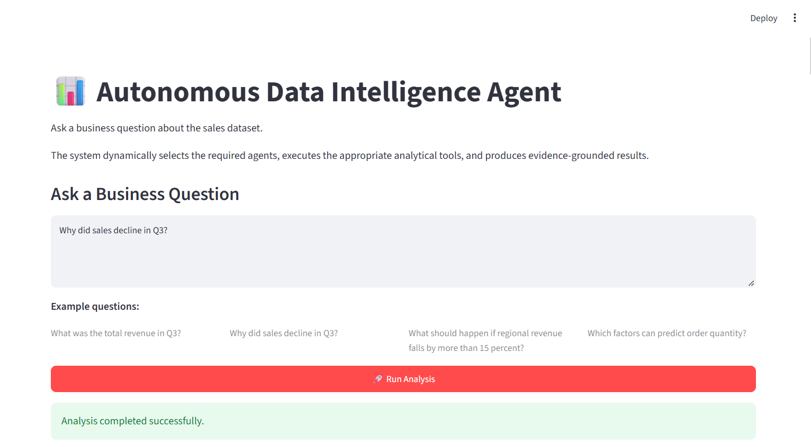
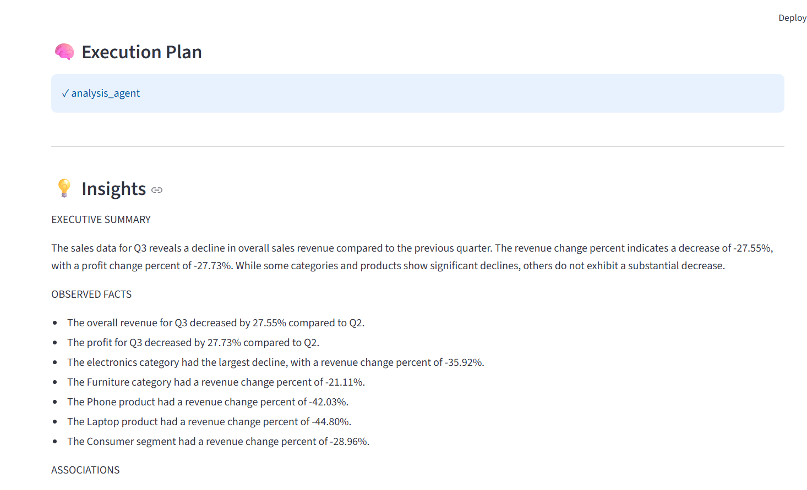
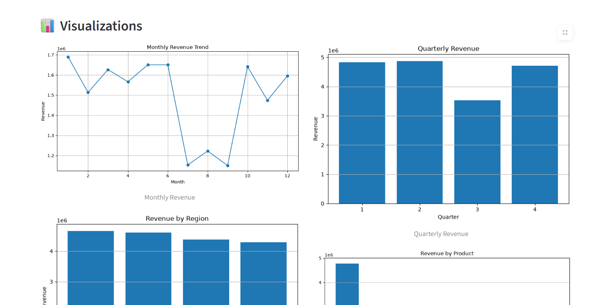
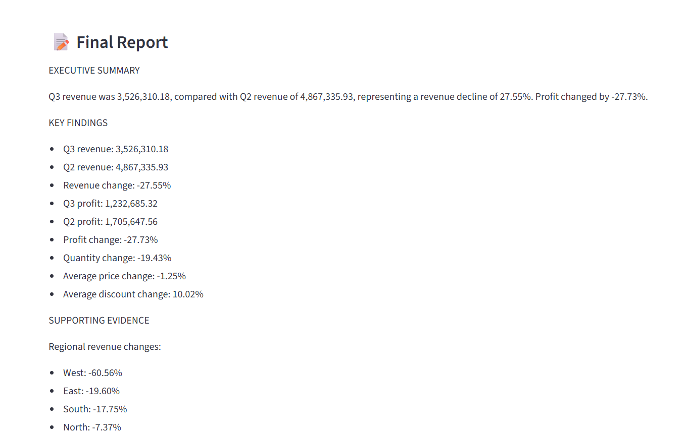

# Autonomous Data Intelligence Agent

An agentic AI system that takes natural-language business questions and dynamically determines how to analyze, retrieve, and report the required information from structured data and business knowledge.

The system combines planning, tool selection, specialized agents, SQL analytics, machine learning, visualization, and Retrieval-Augmented Generation (RAG) to produce evidence-grounded business insights and structured reports.

---

## Overview

Instead of requiring the user to manually select an analysis method, the system interprets a business question and determines the appropriate execution path.

### Example Questions

- What was the total revenue in Q3?
- Why did sales decline in Q3?
- What should happen if regional revenue falls by more than 15 percent?
- Which factors can predict order quantity?
- Show the general patterns in the dataset.

### Core Workflow

```text
User Question
      ↓
Planning
      ↓
Agent Selection
      ↓
Tool Selection
      ↓
Tool Execution
      ↓
Evidence Collection
      ↓
Insight Generation
      ↓
Final Report
```

---
## Demo Screenshots

### Main Interface


### Execution Plan & Evidence-Grounded Insights


### Visualizations


### Final Report


## Architecture

The system follows a modular agentic architecture.

### Main Components

- **Planner** — determines which specialized agent or agents are required.
- **Orchestrator** — coordinates the end-to-end execution workflow.
- **Data Agent** — performs dataset inspection and cleaning.
- **Analysis Agent** — selects and executes analytical tools.
- **Knowledge Agent** — retrieves relevant business-policy information using RAG.
- **Visualization Agent** — generates business visualizations.
- **Insight Agent** — converts analytical results into evidence-grounded insights.
- **Report Agent** — produces the final structured business report.
- **Tool Selector / Router** — selects the appropriate analytical tool using deterministic rules and an LLM fallback.
- **Tool Executor** — executes approved tools and validates tool requests.

---

## Agent Execution Flow

```text
                         User Question
                               │
                               ▼
                            Planner
                               │
                               ▼
                         Orchestrator
                               │
             ┌─────────────────┼─────────────────┐
             │                 │                 │
             ▼                 ▼                 ▼
        Data Agent       Analysis Agent    Knowledge Agent
             │                 │                 │
             │                 ▼                 ▼
             │           Tool Selector           RAG
             │                 │
             │       ┌─────────┼─────────┐
             │       │         │         │
             │       ▼         ▼         ▼
             │      EDA       SQL       ML
             │                           │
             │                    Diagnostic Analysis
             │                           │
             │                     Visualization
             │
             └─────────────────┬─────────────────┘
                               ▼
                         Insight Agent
                               │
                               ▼
                          Report Agent
                               │
                               ▼
                         Final Report
```

---

## Hybrid Planning and Tool Routing

The system uses a hybrid routing approach.

### Deterministic Routing

High-confidence question patterns are handled using explicit routing rules.

Examples:

| Question Type | Selected Tool / Agent |
|---|---|
| Policy / business-rule question | RAG |
| Data-quality question | Dataset Inspector / Data Cleaning |
| Visualization request | Analysis + Visualization |
| ML / prediction question | Machine Learning |
| Numerical aggregation | SQL |
| Business diagnostic question | Diagnostic Analysis |
| General data analysis | EDA / Analysis |

### LLM Fallback

When a question does not match the deterministic rules, the system uses the local LLM to select an appropriate tool.

The router validates the LLM response against an approved list of tools before execution.

---

## Available Tools

| Tool | Purpose |
|---|---|
| Dataset Inspector | Inspects schema, data types, missing values, duplicates and numerical statistics |
| Data Cleaning | Handles missing values, duplicate rows and date columns |
| EDA | Performs revenue, profit, regional, product, customer-segment and time-based analysis |
| Diagnostic Analysis | Compares business performance between periods and identifies major observed changes |
| Visualization | Generates business-performance charts |
| SQL | Executes safe read-only SQL queries |
| Machine Learning | Trains and evaluates a Random Forest regression model |
| RAG | Retrieves relevant business knowledge using semantic search |

---

## Structured Data Analysis

The system works with a sales dataset containing fields such as:

- Order ID
- Order date
- Region
- Country
- Product
- Category
- Customer segment
- Quantity
- Unit price
- Discount
- Revenue
- Cost
- Profit

The project includes a dataset-generation utility so the dataset can be reproduced locally instead of storing the generated dataset in the repository.

---

## SQL Tool

The SQL tool loads the sales data into SQLite and supports **read-only SQL queries**.

The tool blocks database-modifying operations such as:

- `INSERT`
- `UPDATE`
- `DELETE`
- `DROP`
- `ALTER`
- `CREATE`
- `TRUNCATE`
- `REPLACE`

This provides a controlled way to answer structured business questions while preventing direct database modification through the agent.

---

## Machine Learning

The project includes a machine-learning tool for predicting **order quantity** using a Random Forest Regressor.

### Features

The model uses:

- Unit price
- Discount
- Region
- Product
- Category
- Customer segment
- Month
- Quarter

Categorical features are handled using one-hot encoding, while numerical features are passed directly into the model pipeline.

### Evaluation Metrics

The model is evaluated using:

- MAE
- RMSE
- R²

A baseline prediction using the training-set mean is also calculated for comparison.

---

## RAG Knowledge System

The project includes a Retrieval-Augmented Generation pipeline for answering business-policy questions.

### RAG Pipeline

```text
Business Policy Documents
          ↓
Document Loading
          ↓
Text Chunking
          ↓
Embeddings
          ↓
Chroma Vector Database
          ↓
Similarity Search
          ↓
Retrieved Evidence
          ↓
Knowledge Agent
```

### Implementation

The RAG pipeline uses:

- HuggingFace sentence-transformer embeddings
- `all-MiniLM-L6-v2`
- Recursive character text splitting
- Chroma vector database
- Similarity search

The knowledge base is built from text documents stored in:

```text
data/documents/
```

---

## Evidence-Grounded Insights

The Insight Agent is designed to reduce unsupported or misleading conclusions.

The system follows explicit evidence rules:

- Numerical claims must come directly from available evidence.
- Numbers must not be invented.
- Facts, associations, possible explanations and recommendations are separated.
- Correlation is not treated as causation.
- Causal claims require supporting evidence.
- Recommendations should follow from available evidence or business policy.
- Weak ML performance should be reported as a limitation.

### Insight Structure

Generated insights are organized into:

1. Executive Summary
2. Observed Facts
3. Associations
4. Possible Explanations
5. Recommendations
6. Limitations

---

## Reporting

The Report Agent converts analytical outputs and generated insights into a structured final report.

Depending on the question, reports can include:

- Executive summary
- Key findings
- Supporting evidence
- Regional analysis
- Product analysis
- Category analysis
- Customer-segment analysis
- ML performance
- Business recommendations
- Limitations

The application also provides an option to download the generated report.

---

## Evaluation

The project includes evaluation scripts for different parts of the system.

### Planner Evaluation

Checks whether business questions are routed to the expected agents.

### Tool Router Evaluation

Checks whether questions are routed to the expected tools.

### RAG Retrieval Evaluation

Tests whether relevant business-policy concepts can be retrieved from the vector database.

These evaluations provide basic automated checks for routing and retrieval behaviour.

---

## Local LLM

The project uses a local LLM through **Ollama**.

### Current Model

```text
llama3.2:3b
```

The LLM is used for tasks such as ambiguous tool routing and insight generation.

---

## Tech Stack

- Python
- Pandas
- NumPy
- Scikit-learn
- Matplotlib
- Seaborn
- SQLite
- SQLAlchemy
- LangChain
- LangGraph
- Chroma
- HuggingFace Embeddings
- Streamlit
- Ollama
- Python-dotenv

---

## Project Structure

```text
Autonomous_Data_Intelligence_Agent/
├── src/
│   ├── agents/
│   │   ├── app.py
│   │   ├── orchestrator.py
│   │   ├── planner.py
│   │   ├── data_agent.py
│   │   ├── analysis_agent.py
│   │   ├── knowledge_agent.py
│   │   ├── visualization_agent.py
│   │   ├── insight_agent.py
│   │   ├── report_agent.py
│   │   ├── tool_selector.py
│   │   ├── tool_executor.py
│   │   └── evaluation.py
│   ├── llm/
│   ├── rag/
│   ├── tools/
│   └── utils/
├── data/
├── reports/
├── README.md
├── requirements.txt
└── .gitignore
```

---

## Setup

### 1. Clone the Repository

```bash
git clone https://github.com/Nishanth123455/Autonomous-Data-Intelligence-Agent.git
cd Autonomous-Data-Intelligence-Agent
```

### 2. Create a Virtual Environment

```bash
python -m venv .venv
```

### Windows

```bash
.venv\Scripts\activate
```

### Linux / macOS

```bash
source .venv/bin/activate
```

### 3. Install Dependencies

```bash
pip install -r requirements.txt
```

### 4. Install and Run Ollama

Install Ollama and make sure the configured model is available:

```bash
ollama pull llama3.2:3b
```

Make sure the Ollama service is running before launching the application.

---

## Preparing the Data

The generated sales dataset is intentionally excluded from version control.

The project includes a dataset-generation utility located at:

```text
src/utils/create_dataset.py
```

Use this utility to recreate the dataset locally.

The generated data and processed artifacts are stored locally under the `data/` directory.

---

## Building the RAG Knowledge Base

The RAG ingestion script reads business-policy text files from:

```text
data/documents/
```

and builds the local Chroma vector database.

Run the ingestion script from the project environment when setting up the knowledge base.

---

## Running the Application

The Streamlit interface provides a natural-language entry point to the agent system.

Run:

```bash
streamlit run src/agents/app.py
```

The application provides:

- Natural-language business question input
- Autonomous agent planning
- Execution plan display
- Generated insights
- Visualizations
- Final report
- Report download
- Raw agent-result inspection

---

## Example Workflow

### User Question

```text
Why did sales decline in Q3?
```

### Example Execution

```text
User Question
      ↓
Planner
      ↓
Analysis Agent
      ↓
Diagnostic Analysis Tool
      ↓
Regional / Product / Category / Segment Analysis
      ↓
Insight Agent
      ↓
Evidence-Grounded Insights
      ↓
Report Agent
      ↓
Final Business Report
```

For a policy question such as:

```text
What should happen if regional revenue falls by more than 15 percent?
```

the system can route the request to the knowledge/RAG workflow to retrieve the relevant business policy.

---

## Reproducibility

Generated artifacts are intentionally excluded from the repository, including:

- Raw generated datasets
- Processed datasets
- SQLite databases
- Chroma vector-store files
- Generated reports

The repository instead contains the source code required to recreate these artifacts locally.

---

## Limitations

- Many high-confidence routing decisions currently depend on explicit question patterns.
- Ambiguous questions depend on the local LLM fallback.
- The system is designed as a prototype rather than a production enterprise platform.
- The quality of generated insights depends on the quality of the underlying analytical evidence and retrieved knowledge.
- The ML component is a baseline predictive system and should not be interpreted as causal evidence.
- The current system focuses on business/data-intelligence workflows rather than general-purpose autonomous computer operation.

---

## Future Improvements

- Improve intent classification and planning for more complex multi-step questions.
- Introduce persistent conversational memory.
- Add more advanced state management across agent executions.
- Expand the tool ecosystem and external integrations.
- Improve automated failure detection and recovery.
- Add stronger agent-level evaluation and observability.
- Add human approval checkpoints for sensitive operations.
- Support additional enterprise data sources and connectors.
- Improve generalization across different business workflows.
- Extend the system toward more autonomous enterprise task execution.

---

## Notes

This project is a prototype demonstrating an agentic approach to business data intelligence.

It focuses on dynamically determining the required analytical capabilities, selecting and executing tools, grounding generated insights in evidence, and producing useful business outputs.